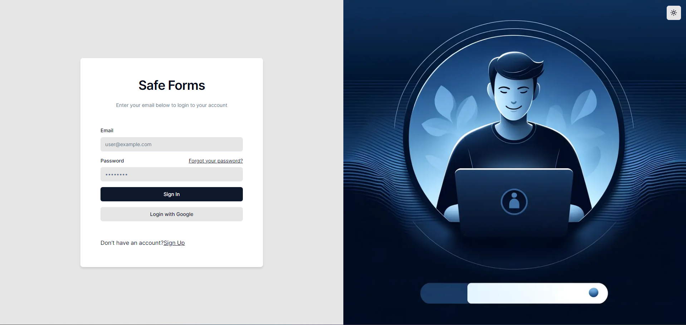
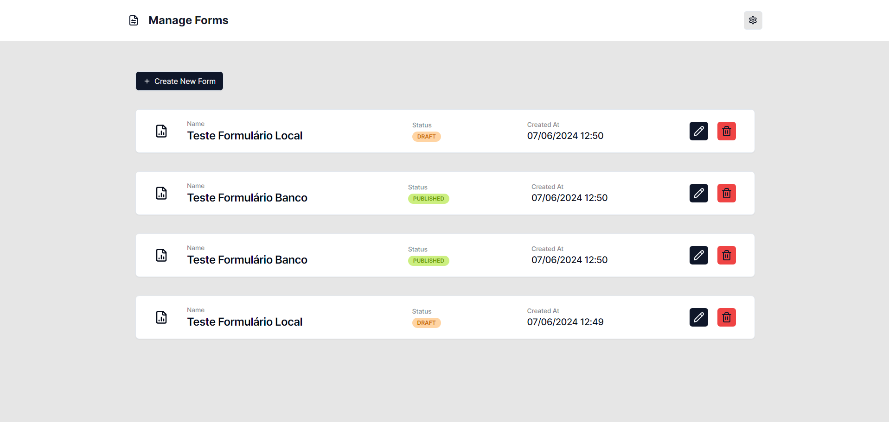

# SafeForms

- [SafeForms](#safeforms)
  - [Visão Geral](#visão-geral)
  - [Fluxo de Uso](#fluxo-de-uso)
  - [Tecnologias Utilizadas](#tecnologias-utilizadas)
    - [Linguagem](#linguagem)
    - [Arquiterura (Monorepo)](#arquiterura-monorepo)
    - [Frontend](#frontend)
    - [Backend](#backend)
    - [Autenticação](#autenticação)
    - [Banco de Dados](#banco-de-dados)
    - [CI/CD](#cicd)
    - [Hosts](#hosts)
  - [Fluxo de Telas](#fluxo-de-telas)
    - [Tela de login](#tela-de-login)
    - [Tela de listagem de formulários](#tela-de-listagem-de-formulários)
    - [Tela de criação de formulário](#tela-de-criação-de-formulário)
  - [Configuração de ambiente](#configuração-de-ambiente)

## Visão Geral

A aplicação Safe Forms é um projeto full-stack projetado para gerenciar formulários específicos do usuário. Esta aplicação utiliza o Firebase Authentication para lidar com o login do usuário e validação de token, garantindo acesso seguro e personalizado aos dados dos formulários. O backend, construído com NestJS, interage com o Firebase Admin SDK para autenticar solicitações e gerenciar dados específicos do usuário, enquanto o frontend, construído com React e Next.js, integra perfeitamente o Firebase Auth para autenticação de usuários.

## Fluxo de Uso

1. Ao entrar na aplicação você deve efetuar seu cadastro pela tela de sign up.
2. Após o cadatro faça o login na aplicação.
3. Entrando a primeira vez na aplicação você poderá cadastrar um novo formulário
4. Dentro da criação de formulário temos dois status que ele pode estar:
     - **Draft**: Status onde o fomulário ainda não está completo e salvo localmente.
  
     - **Published**: Status onde o fomulário está completo e salvo no banco de dados.
5. É possivel também editar um formulário, temos 3 casos de uso:
    1. Caso esteja no status **Draft** e não for completado ele continua no mesmo status.

    2. Caso esteja no status **Published** ele não poderá virar **Draft** mas ele pode ser editado normalmente assim se mantendo no mesmo status.

    3. Caso esteja no status **Draft** e for completado ele vai para o status **Published**

## Tecnologias Utilizadas

### Linguagem

- [TypeScript](https://www.typescriptlang.org/)

### Arquiterura (Monorepo)

- [Yarn Workspace](https://classic.yarnpkg.com/en/docs/workspaces/)

### Frontend

- [React](https://reactjs.org/)
- [Next.js](https://nextjs.org/)
- [Ui Shadcn](https://shadcn.dev/)
- [TanStack (React Query)](https://tanstack.com/query/v4)
- [Tailwind CSS](https://tailwindcss.com/)
- [axios](https://axios-http.com/)
- [React Hook Form](https://react-hook-form.com/) com [Zod](https://zod.dev/)

### Backend

- [NestJS](https://nestjs.com/)
- [Swagger](https://swagger.io/)
- [Firebase Admin SDK](https://firebase.google.com/docs/admin/setup)

### Autenticação

- [Firebase Authentication](https://firebase.google.com/docs/auth)

### Banco de Dados

- [Firestore Database](https://firebase.google.com/docs/firestore)

### CI/CD

- [GitHub Actions](https://docs.github.com/pt/actions)

### Hosts

- [Vercel (Frontend)](https://vercel.com/)
- [Azure Web App (Backend)](https://azure.microsoft.com/)

## Fluxo de Telas

### Tela de login



### Tela de listagem de formulários



### Tela de criação de formulário


## Configuração de ambiente

1. No root do projeto rode o comando yarn install para instalar todas as depedencias de todos os projetos.
2. Adicionar envs para projetos:
    - **Frontend**: Criar um arquivo .env na pasta frontend na raiz com as seguindes variaveis:

    ```sh
    NEXT_PUBLIC_FIREBASE_API_KEY=
    NEXT_PUBLIC_FIREBASE_AUTH_DOMAIN=
    NEXT_PUBLIC_FIREBASE_PROJECT_ID=
    NEXT_PUBLIC_FIREBASE_STORAGE_BUCKET=
    NEXT_PUBLIC_FIREBASE_MESSAGING_SENDER_ID=
    NEXT_PUBLIC_FIREBASE_APP_ID=
    NEXT_PUBLIC_FIREBASE_MEASUREMENT_ID=
    NEXT_PUBLIC_API_URL=http://localhost:4000
    ```

    - **Backend**: Criar um arquivo .env na pasta backend na raiz com as seguindes variaveis:

    ```sh
    FIREBASE_PROJECT_ID=
    FIREBASE_PRIVATE_KEY=
    FIREBASE_CLIENT_EMAIL=
    ```

3. Para rodar os projetos temos os comandos:
    - **Frontend** (PORT 3000):

    ```sh
    yarn start:frontend
    ```

    - **Backend** (PORT 4000):

    ```sh
    yarn start:backend
    ```

     [Open swagger local](http://localhost:4000/api#/)

     
