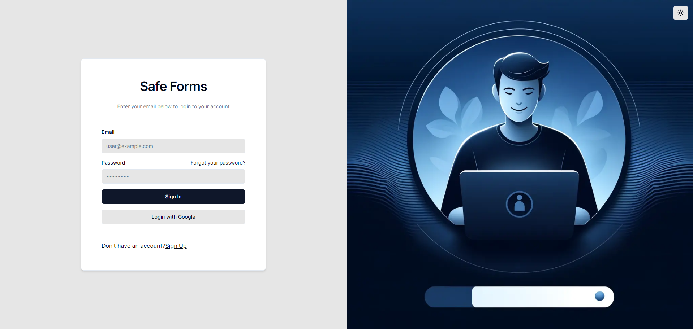
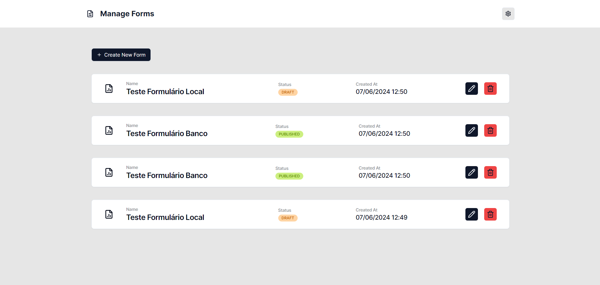
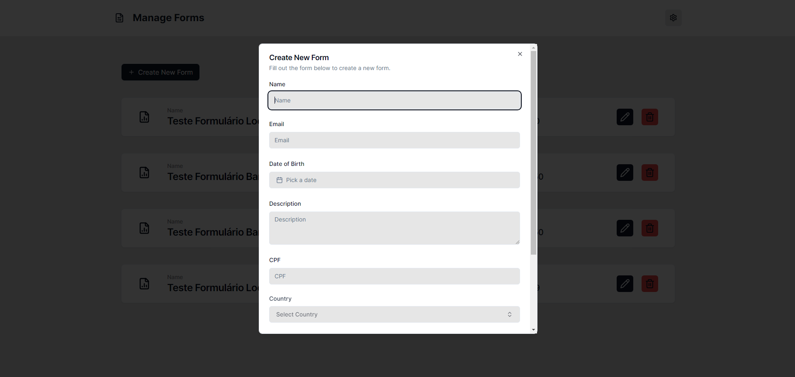
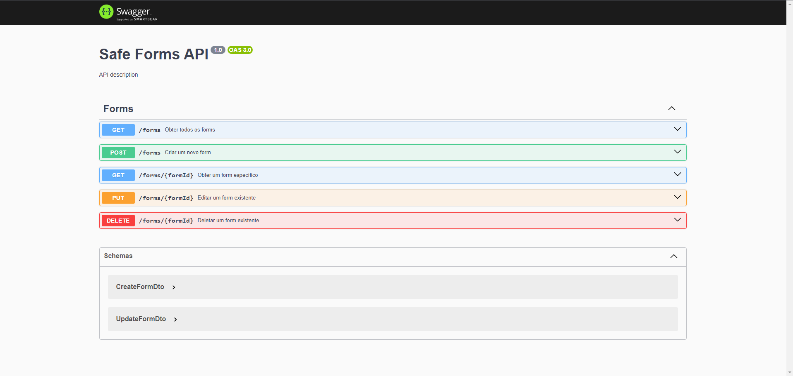

# SafeForms

- [SafeForms](#safeforms)
  - [Overview](#overview)
  - [Usage Flow](#usage-flow)
  - [Technologies Used](#technologies-used)
    - [Language](#language)
    - [Architecture (Monorepo)](#architecture-monorepo)
    - [Frontend](#frontend)
    - [Backend](#backend)
    - [Authentication](#authentication)
    - [Database](#database)
    - [CI/CD](#cicd)
    - [Hosts](#hosts)
  - [Screen Flow](#screen-flow)
    - [Login Screen](#login-screen)
    - [Form Listing Screen](#form-listing-screen)
    - [Form Creation Screen](#form-creation-screen)
  - [Environment Setup](#environment-setup)

## Overview

The Safe Forms application is a full-stack project designed to manage user-specific forms. This application uses Firebase Authentication to handle user login and token validation, ensuring secure and personalized access to form data. The backend, built with NestJS, interacts with the Firebase Admin SDK to authenticate requests and manage user-specific data, while the frontend, built with React and Next.js, seamlessly integrates Firebase Auth for user authentication.

## Usage Flow

1. Upon entering the application, you must register via the sign-up screen.
2. After registration, log in to the application.
3. Upon first entering the application, you can register a new form.
4. In the form creation screen, there are two statuses the form can be in:
     - **Draft**: Status where the form is not yet complete and is saved locally.
  
     - **Published**: Status where the form is complete and saved in the database.
5. You can also edit a form with three use cases:
    1. If it is in **Draft** status and not completed, it remains in the same status.

    2. If it is in **Published** status, it cannot revert to **Draft** but can be edited normally while remaining in the same status.

    3. If it is in **Draft** status and completed, it moves to **Published** status.

## Technologies Used

### Language

- [TypeScript](https://www.typescriptlang.org/)

### Architecture (Monorepo)

- [Yarn Workspace](https://classic.yarnpkg.com/en/docs/workspaces/)

### Frontend

- [React](https://reactjs.org/)
- [Next.js](https://nextjs.org/)
- [Ui Shadcn](https://shadcn.dev/)
- [TanStack (React Query)](https://tanstack.com/query/v4)
- [Tailwind CSS](https://tailwindcss.com/)
- [axios](https://axios-http.com/)
- [React Hook Form](https://react-hook-form.com/) with [Zod](https://zod.dev/)

### Backend

- [NestJS](https://nestjs.com/)
- [Swagger](https://swagger.io/)
- [Firebase Admin SDK](https://firebase.google.com/docs/admin/setup)

### Authentication

- [Firebase Authentication](https://firebase.google.com/docs/auth)

### Database

- [Firestore Database](https://firebase.google.com/docs/firestore)

### CI/CD

- [GitHub Actions](https://docs.github.com/pt/actions)

### Hosts

- [Vercel (Frontend)](https://vercel.com/)
- [Azure Web App (Backend)](https://azure.microsoft.com/)

## Screen Flow

### Login Screen



### Form Listing Screen



### Form Creation Screen



## Environment Setup

1. In the root of the project, run the command `yarn install` to install all dependencies for all projects.

2. Add environment variables for the projects:
    - **Frontend**: Create a `.env` file in the root of the frontend folder with the following variables:

    ```sh
    NEXT_PUBLIC_FIREBASE_API_KEY=
    NEXT_PUBLIC_FIREBASE_AUTH_DOMAIN=
    NEXT_PUBLIC_FIREBASE_PROJECT_ID=
    NEXT_PUBLIC_FIREBASE_STORAGE_BUCKET=
    NEXT_PUBLIC_FIREBASE_MESSAGING_SENDER_ID=
    NEXT_PUBLIC_FIREBASE_APP_ID=
    NEXT_PUBLIC_FIREBASE_MEASUREMENT_ID=
    NEXT_PUBLIC_API_URL=http://localhost:4000
    ```

    - **Backend**: Create a `.env` file in the root of the backend folder with the following variables:

    ```sh
    FIREBASE_PROJECT_ID=
    FIREBASE_PRIVATE_KEY=
    FIREBASE_CLIENT_EMAIL=
    ```

3. To run the projects, use the following commands:
    - **Frontend** (PORT 3000):

    ```sh
    yarn start:frontend
    ```

    - **Backend** (PORT 4000):

    ```sh
    yarn start:backend
    ```
    [Open swagger local](http://localhost:4000/api#/)

    
